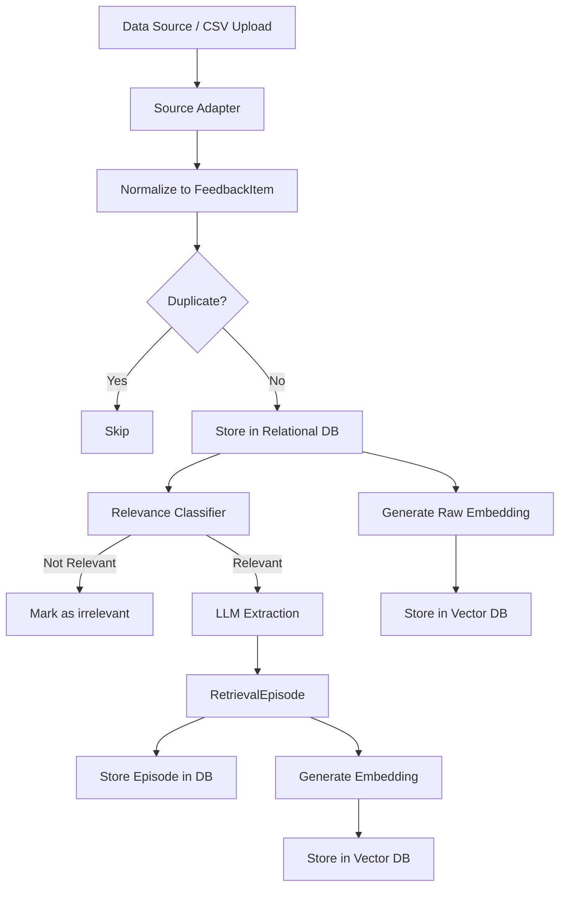
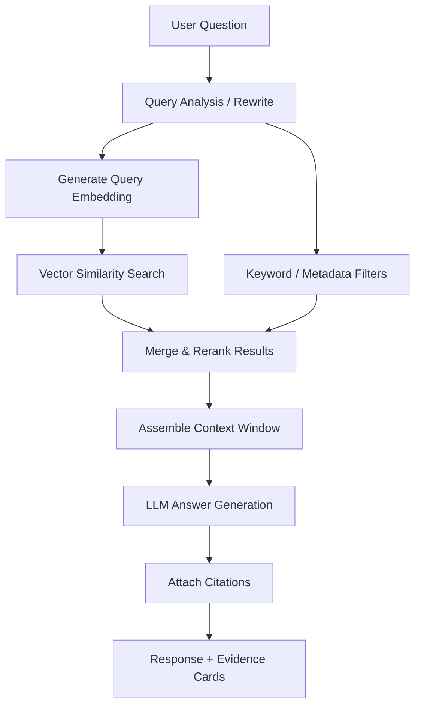
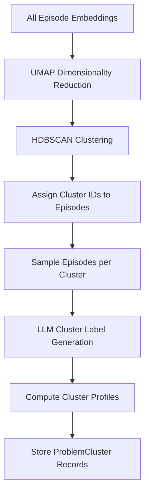

# Architecture: AI-Powered Photo Retrieval Discovery Engine

> Detailed technical architecture derived from the [project context](file:///c:/Users/rparv/.antigravity-ide/Google%20Photos/docs/context.md).

---

## 1. High-Level System Overview

```
┌─────────────────────────────────────────────────────────────────────────┐
│                          RESEARCH UI (Frontend)                        │
│  ┌──────────────┐  ┌────────────────┐  ┌──────────┐  ┌──────────────┐  │
│  │  Discovery    │  │  Ask the       │  │ Problem  │  │  Evidence    │  │
│  │  Dashboard    │  │  Research Engine│  │ Explorer │  │  Cards      │  │
│  └──────┬───────┘  └───────┬────────┘  └────┬─────┘  └──────┬───────┘  │
└─────────┼──────────────────┼────────────────┼────────────────┼──────────┘
          │                  │                │                │
          ▼                  ▼                ▼                ▼
┌─────────────────────────────────────────────────────────────────────────┐
│                          API GATEWAY / BACKEND                         │
│  ┌──────────────┐  ┌────────────────┐  ┌──────────────┐  ┌──────────┐  │
│  │  Ingestion   │  │  RAG / Q&A     │  │  Clustering  │  │ Analytics│  │
│  │  Service     │  │  Service       │  │  Service     │  │ Service  │  │
│  └──────┬───────┘  └───────┬────────┘  └──────┬───────┘  └────┬─────┘  │
└─────────┼──────────────────┼─────────────────┼───────────────┼──────────┘
          │                  │                 │               │
          ▼                  ▼                 ▼               ▼
┌─────────────────────────────────────────────────────────────────────────┐
│                          DATA & AI LAYER                               │
│  ┌──────────────┐  ┌────────────────┐  ┌──────────────────────────┐    │
│  │  Relational  │  │  Vector DB     │  │  LLM (Extraction + RAG) │    │
│  │  DB (SQLite/ │  │  (ChromaDB)    │  │  (Groq — Llama 3 /      │    │
│  │  PostgreSQL) │  │                │  │   Mixtral)               │    │
│  └──────────────┘  └────────────────┘  └──────────────────────────┘    │
└─────────────────────────────────────────────────────────────────────────┘
```

The system is organized into **three tiers**:

| Tier | Responsibility |
|---|---|
| **Frontend** | Research UI — dashboard, chat, problem explorer, evidence cards |
| **Backend** | API services — ingestion, RAG Q&A, clustering, analytics |
| **Data & AI** | Persistent storage (relational + vector) and LLM orchestration |

---

## 2. Component Architecture

### 2.1 Data Ingestion Service

Responsible for collecting, normalizing, and storing raw user feedback.

```
                    ┌─────────────────┐
                    │   Data Sources   │
                    │  (Reddit, YT,    │
                    │  Forums, CSV/    │
                    │  JSON upload)    │
                    └────────┬────────┘
                             │
                             ▼
                    ┌─────────────────┐
                    │  Source Adapters │
                    │  (per-platform   │
                    │   normalizer)    │
                    └────────┬────────┘
                             │
                    ┌────────▼────────┐
                    │  Deduplication   │
                    │  & Validation    │
                    └────────┬────────┘
                             │
               ┌─────────────┼──────────────┐
               ▼             ▼              ▼
        ┌────────────┐ ┌──────────┐  ┌────────────┐
        │ Raw Store  │ │ AI       │  │ Embedding  │
        │ (Rel. DB)  │ │ Extractor│  │ Generator  │
        └────────────┘ └────┬─────┘  └─────┬──────┘
                            │              │
                            ▼              ▼
                     ┌────────────┐  ┌──────────┐
                     │ Episodes   │  │ Vector   │
                     │ Store      │  │ DB       │
                     └────────────┘  └──────────┘
```

#### Source Adapters

Each data source gets a dedicated adapter that handles:

| Adapter | Input | Normalization |
|---|---|---|
| `RedditAdapter` | Reddit API (PRAW) / JSON export | Post + comments → `FeedbackItem` |
| `YouTubeAdapter` | YouTube Data API / CSV | Comments → `FeedbackItem` |
| `CommunityAdapter` | Scraped HTML / JSON | Thread + replies → `FeedbackItem` |
| `PlayStoreAdapter` | Google Play Developer API / `google-play-scraper` / CSV | Reviews → `FeedbackItem` |
| `AppStoreAdapter` | Apple App Store API / CSV | Reviews → `FeedbackItem` |
| `CSVUploadAdapter` | User-uploaded CSV/JSON | Row → `FeedbackItem` |

Each adapter produces a normalized `FeedbackItem` (see §3.1).

#### Deduplication & Validation

- **Fingerprint-based dedup** — hash of (source + author_id + normalized_text) to prevent duplicate ingestion.
- **Relevance filter** — lightweight LLM or keyword classifier to determine if feedback relates to photo retrieval (binary: relevant / not relevant). This prevents noise from general app reviews.
- **Validation** — schema checks, URL validation, date normalization.

---

### 2.2 AI Extraction Pipeline

Converts raw `FeedbackItem`s into structured `RetrievalEpisode`s.

```
FeedbackItem ──► Relevance Classifier ──► LLM Structured Extraction ──► RetrievalEpisode
                        │                          │
                   (discard if                (prompt + schema)
                    not relevant)
```

#### Extraction Prompt Strategy

The LLM receives:

1. **System prompt** — role definition, extraction schema, examples.
2. **User feedback text** — the raw feedback content.
3. **Output format** — structured JSON matching the `RetrievalEpisode` schema.

The prompt explicitly instructs the LLM to:

- Extract only information **present in the text** (no hallucination).
- Mark fields as `null` / `unknown` when information is absent.
- Quote the supporting evidence verbatim from the original text.
- Classify memory type, retrieval method, and failure reason using controlled vocabularies (see §3.3).

#### Batch Processing

- Process feedback items in configurable batch sizes (default: 10).
- Retry with exponential backoff on LLM API failures.
- Store extraction status per item (`pending`, `processing`, `completed`, `failed`).
- Support re-extraction when prompt/schema is updated.

---

### 2.3 Embedding & Vector Store

#### Embedding Strategy

Generate embeddings for two document types:

| Document Type | Text Used for Embedding | Purpose |
|---|---|---|
| **Raw feedback** | Full original text | Broad semantic search over user language |
| **Retrieval episode** | Concatenation of: user_goal + remembered_clues + forgotten_info + failure_reason | Structured similarity search over retrieval patterns |

#### Chunking

- Raw feedback: embed as-is (typically short — review or comment length).
- Long threads: split into individual posts/comments, each embedded separately, linked by `thread_id`.

#### Vector DB Schema

```
Collection: feedback_embeddings
  - id: string (feedback_item_id)
  - embedding: float[1024]
  - metadata:
      - source: string
      - date: ISO-8601
      - is_relevant: bool
      - episode_id: string | null

Collection: episode_embeddings
  - id: string (episode_id)
  - embedding: float[1024]
  - metadata:
      - memory_type: string
      - failure_reason: string[]
      - retrieval_method: string[]
      - problem_cluster: string | null
      - source: string
```

---

### 2.4 RAG Q&A Service

Answers research questions grounded in the collected evidence.

```
User Question
     │
     ▼
┌─────────────┐     ┌────────────────┐     ┌───────────────┐
│  Query       │────►│  Vector Search  │────►│  Context      │
│  Analysis    │     │  (top-k docs)  │     │  Assembly     │
└─────────────┘     └────────────────┘     └───────┬───────┘
                                                   │
                                                   ▼
                                           ┌───────────────┐
                                           │  LLM Answer   │
                                           │  Generation   │
                                           └───────┬───────┘
                                                   │
                                                   ▼
                                           ┌───────────────┐
                                           │  Response +   │
                                           │  Citations    │
                                           └───────────────┘
```

#### Query Pipeline

1. **Query analysis** — LLM rewrites the user's question into an optimized search query. May generate multiple sub-queries for complex questions.
2. **Hybrid retrieval** — combine vector similarity search with keyword filters (source, date range, memory type, etc.).
3. **Context assembly** — rank and deduplicate retrieved documents; assemble a context window within token limits.
4. **Answer generation** — LLM generates a grounded answer, explicitly citing source evidence.
5. **Citation attachment** — each claim in the answer links back to specific `FeedbackItem` IDs and source URLs.

#### Retrieval Parameters

| Parameter | Default | Description |
|---|---|---|
| `top_k` | 20 | Number of candidate documents retrieved from vector search |
| `rerank_top_n` | 8 | Number of documents after reranking to include in context |
| `similarity_threshold` | 0.65 | Minimum cosine similarity to include a result |
| `max_context_tokens` | 6000 | Maximum tokens in the assembled context window |

#### Grounding Rules

- Every claim must cite at least one source document.
- If fewer than 3 relevant documents are found, the system prefixes the answer with: *"Limited evidence available — the following is based on [N] source(s)."*
- The system **never** fabricates quotes or statistics.

---

### 2.5 Problem Clustering Service

Groups `RetrievalEpisode`s into thematic problem areas.

#### Clustering Approach

```
Episode Embeddings ──► Dimensionality Reduction (UMAP) ──► Clustering (HDBSCAN)
                                                                  │
                                                                  ▼
                                                        ┌─────────────────┐
                                                        │  Cluster Label  │
                                                        │  Generation     │
                                                        │  (LLM)         │
                                                        └─────────────────┘
```

1. **Dimensionality reduction** — UMAP projects high-dimensional episode embeddings into a lower-dimensional space.
2. **Density-based clustering** — HDBSCAN identifies natural groupings (supports variable-density clusters and noise points).
3. **Cluster labelling** — LLM reads a sample of episodes in each cluster and generates a human-readable label + summary.
4. **Cluster profiling** — for each cluster, aggregate:
   - Episode count
   - Most common remembered clues
   - Most common forgotten information
   - Dominant retrieval methods
   - Dominant failure reasons
   - Representative evidence excerpts
   - Source distribution

#### Seeded Categories

The system seeds initial clusters with the expected problem areas from the problem statement:

- Event/trip-based retrieval
- People/context retrieval
- Visual-object retrieval
- Screenshot/document retrieval
- Location-based retrieval
- Approximate-time retrieval
- Text-inside-image retrieval

New clusters can emerge organically from the data. The system supports **re-clustering** when new data is ingested.

---

### 2.6 Analytics Service

Computes and caches aggregate metrics for the dashboard.

| Metric | Computation |
|---|---|
| Total feedback analyzed | `COUNT(*)` on `feedback_items` |
| Relevant feedback | `COUNT(*) WHERE is_relevant = true` |
| Retrieval episodes | `COUNT(*)` on `retrieval_episodes` |
| Problem clusters | `COUNT(DISTINCT cluster_id)` on episodes |
| Source breakdown | `GROUP BY source` on `feedback_items` |
| Top remembered clues | Frequency analysis across episodes |
| Top forgotten info | Frequency analysis across episodes |
| Top failure reasons | Frequency analysis across episodes |
| Retrieval method distribution | Frequency analysis across episodes |

Metrics are cached and refreshed on ingestion events or on demand.

---

## 3. Data Models

### 3.1 FeedbackItem (Raw Feedback)

```json
{
  "id": "uuid",
  "source": "reddit | youtube | community | playstore | appstore | csv_upload",
  "source_url": "https://...",
  "author_id": "anonymized_hash",
  "text": "Original user feedback text...",
  "date": "2026-03-15T10:30:00Z",
  "thread_id": "string | null",
  "parent_id": "string | null",
  "platform_metadata": {
    "subreddit": "GooglePhotos",
    "score": 42,
    "...": "..."
  },
  "is_relevant": true,
  "relevance_score": 0.92,
  "fingerprint": "sha256_hash",
  "ingested_at": "2026-09-27T00:00:00Z",
  "extraction_status": "completed"
}
```

### 3.2 RetrievalEpisode (Structured Extraction)

```json
{
  "id": "uuid",
  "feedback_item_id": "uuid (FK → FeedbackItem)",
  "user_goal": "Find photos from a family trip to Goa in 2023",
  "memory_type": "event_trip",
  "remembered_clues": [
    { "type": "event", "value": "family trip to Goa" },
    { "type": "approximate_time", "value": "sometime in 2023" },
    { "type": "person", "value": "family members" }
  ],
  "forgotten_info": [
    { "type": "exact_date", "value": null },
    { "type": "album", "value": null }
  ],
  "retrieval_attempt": [
    { "method": "keyword_search", "detail": "searched 'Goa trip'" },
    { "method": "timeline_browsing", "detail": "scrolled through 2023" }
  ],
  "failure_reason": [
    "too_many_results",
    "context_not_translatable_to_keywords"
  ],
  "desired_outcome": "Wanted to find the specific beach sunset photos",
  "supporting_evidence": "\"I searched for 'Goa' but got hundreds of results and couldn't find the specific sunset photos from that one evening...\"",
  "source": "reddit",
  "source_url": "https://reddit.com/r/googlephotos/...",
  "problem_cluster": "event_trip_retrieval",
  "extracted_at": "2026-09-27T00:00:00Z"
}
```

### 3.3 Controlled Vocabularies (Enums)

#### Memory Type

```
photo | screenshot | document | video | person_image | object_image | other
```

#### Remembered Clue Type

```
person | location | event_trip | object | approximate_time | activity |
visual_appearance | text_content | context | other
```

#### Forgotten Info Type

```
exact_date | exact_location | album | filename | person_name |
object_name | search_terms | other
```

#### Retrieval Method

```
keyword_search | timeline_browsing | album_browsing | scrolling |
face_person_search | visual_scanning | workaround | other
```

#### Failure Reason

```
cannot_formulate_query | too_many_results | forgotten_date_location |
context_not_translatable_to_keywords | difficulty_describing_visual |
uncertainty_between_similar | feature_missing | other
```

### 3.4 ProblemCluster

```json
{
  "id": "uuid",
  "label": "Event/Trip-Based Retrieval",
  "summary": "Users who remember a trip or event but can't locate the specific photos...",
  "episode_count": 47,
  "common_remembered_clues": ["event_trip", "person", "approximate_time"],
  "common_forgotten_info": ["exact_date", "album"],
  "common_retrieval_methods": ["keyword_search", "timeline_browsing"],
  "common_failure_reasons": ["too_many_results", "context_not_translatable_to_keywords"],
  "representative_evidence": ["episode_id_1", "episode_id_2", "episode_id_3"],
  "source_distribution": { "reddit": 22, "youtube": 10, "community": 15 },
  "created_at": "2026-09-27T00:00:00Z",
  "updated_at": "2026-09-27T00:00:00Z"
}
```

---

## 4. API Design

### 4.1 Ingestion Endpoints

| Method | Endpoint | Description |
|---|---|---|
| `POST` | `/api/ingest/upload` | Upload CSV/JSON file of feedback |
| `POST` | `/api/ingest/scrape` | Trigger scraping for a given source + query |
| `GET` | `/api/ingest/status` | Get ingestion pipeline status |
| `GET` | `/api/ingest/sources` | List all configured sources and stats |

### 4.2 Feedback & Episodes

| Method | Endpoint | Description |
|---|---|---|
| `GET` | `/api/feedback` | List feedback items (paginated, filterable) |
| `GET` | `/api/feedback/:id` | Get single feedback item with linked episodes |
| `GET` | `/api/episodes` | List retrieval episodes (paginated, filterable) |
| `GET` | `/api/episodes/:id` | Get single episode with source feedback |

### 4.3 RAG / Research Q&A

| Method | Endpoint | Description |
|---|---|---|
| `POST` | `/api/ask` | Ask a research question; returns grounded answer + citations |
| `GET` | `/api/ask/history` | Get previous questions and answers |

**Request:**
```json
{
  "question": "What kinds of old photos do users struggle to retrieve?",
  "filters": {
    "sources": ["reddit", "youtube"],
    "date_range": { "from": "2025-01-01", "to": "2026-09-01" }
  }
}
```

**Response:**
```json
{
  "answer": "Based on the collected evidence, users most commonly struggle to retrieve...",
  "confidence": "high",
  "evidence_count": 34,
  "citations": [
    {
      "episode_id": "uuid",
      "feedback_id": "uuid",
      "source": "reddit",
      "source_url": "https://...",
      "excerpt": "\"I have 50,000 photos and I know I took a photo of...\"",
      "relevance_score": 0.94
    }
  ],
  "follow_up_suggestions": [
    "What specific retrieval methods do users try before giving up?",
    "How does retrieval difficulty vary by photo age?"
  ]
}
```

### 4.4 Clustering & Problem Areas

| Method | Endpoint | Description |
|---|---|---|
| `GET` | `/api/clusters` | List all problem clusters with summaries |
| `GET` | `/api/clusters/:id` | Get detailed cluster profile |
| `GET` | `/api/clusters/:id/episodes` | Get episodes belonging to a cluster |
| `POST` | `/api/clusters/recompute` | Trigger re-clustering |

### 4.5 Analytics / Dashboard

| Method | Endpoint | Description |
|---|---|---|
| `GET` | `/api/analytics/overview` | Dashboard summary metrics |
| `GET` | `/api/analytics/sources` | Source breakdown stats |
| `GET` | `/api/analytics/trends` | Trend data over time |
| `GET` | `/api/analytics/distributions` | Distribution of memory types, failure reasons, etc. |

---

## 5. Tech Stack (Recommended)

| Layer | Technology | Rationale |
|---|---|---|
| **Frontend** | React + Vite | Fast dev experience, component-based UI, rich ecosystem |
| **Styling** | Vanilla CSS (design system) | Full control, no framework lock-in |
| **Backend** | Python + FastAPI | Async-native, auto-generated OpenAPI docs, strong ML/AI ecosystem |
| **Relational DB** | SQLite (dev) → PostgreSQL (prod) | SQLite for zero-config local dev; PostgreSQL for production scale |
| **Vector DB** | ChromaDB | Lightweight, embeddable, Python-native, good for prototyping; swap to Qdrant/Pinecone for scale |
| **LLM** | Groq (Llama 3 / Mixtral) | Ultra-fast inference via Groq API; open-source models with strong structured extraction |
| **Embeddings** | BGE `bge-large-en-v1.5` | Local inference (no API cost), 1024-dim, fine-tunable, strong MTEB performance |
| **Task Queue** | Celery + Redis (or in-process for MVP) | Async batch processing of extraction and embedding jobs |
| **Clustering** | UMAP + HDBSCAN (scikit-learn) | Proven unsupervised clustering for text embeddings |

---

## 6. Directory Structure (Proposed)

```
Google Photos/
├── docs/
│   ├── problemstatement.txt        # Original problem statement
│   ├── context.md                  # Project context
│   └── architecture.md             # This file
│
├── backend/
│   ├── main.py                     # FastAPI app entry point
│   ├── config.py                   # Environment config & secrets
│   ├── models/
│   │   ├── feedback.py             # FeedbackItem model
│   │   ├── episode.py              # RetrievalEpisode model
│   │   └── cluster.py              # ProblemCluster model
│   ├── services/
│   │   ├── ingestion/
│   │   │   ├── base_adapter.py     # Abstract source adapter
│   │   │   ├── reddit_adapter.py
│   │   │   ├── youtube_adapter.py
│   │   │   ├── playstore_adapter.py # Google Play Store reviews
│   │   │   ├── csv_adapter.py
│   │   │   └── dedup.py            # Deduplication logic
│   │   ├── extraction/
│   │   │   ├── extractor.py        # LLM-based structured extraction
│   │   │   ├── prompts.py          # Extraction prompts & schemas
│   │   │   └── relevance.py        # Relevance classifier
│   │   ├── rag/
│   │   │   ├── query_engine.py     # RAG Q&A pipeline
│   │   │   ├── retriever.py        # Hybrid vector + keyword retrieval
│   │   │   └── context_builder.py  # Context window assembly
│   │   ├── clustering/
│   │   │   ├── clusterer.py        # UMAP + HDBSCAN pipeline
│   │   │   └── labeller.py         # LLM-based cluster labelling
│   │   └── analytics/
│   │       └── metrics.py          # Aggregate metrics computation
│   ├── db/
│   │   ├── database.py             # DB connection & session management
│   │   ├── vector_store.py         # ChromaDB wrapper
│   │   └── migrations/             # Schema migrations
│   ├── routers/
│   │   ├── ingest.py               # /api/ingest/* routes
│   │   ├── feedback.py             # /api/feedback/* routes
│   │   ├── episodes.py             # /api/episodes/* routes
│   │   ├── ask.py                  # /api/ask/* routes
│   │   ├── clusters.py             # /api/clusters/* routes
│   │   └── analytics.py            # /api/analytics/* routes
│   ├── requirements.txt
│   └── tests/
│       ├── test_extraction.py
│       ├── test_rag.py
│       └── test_clustering.py
│
├── frontend/
│   ├── index.html
│   ├── vite.config.js
│   ├── package.json
│   ├── src/
│   │   ├── main.jsx
│   │   ├── App.jsx
│   │   ├── index.css               # Design system & global styles
│   │   ├── components/
│   │   │   ├── Dashboard.jsx
│   │   │   ├── AskEngine.jsx
│   │   │   ├── ProblemExplorer.jsx
│   │   │   ├── EvidenceCard.jsx
│   │   │   ├── ClusterDetail.jsx
│   │   │   └── SourceBreakdown.jsx
│   │   ├── hooks/
│   │   │   └── useApi.js
│   │   └── utils/
│   │       └── api.js              # Backend API client
│   └── public/
│       └── favicon.ico
│
├── data/
│   ├── raw/                        # Raw ingested feedback (gitignored)
│   └── sample/                     # Sample data for development
│
├── scripts/
│   ├── seed_data.py                # Seed the DB with sample data
│   └── run_extraction.py           # CLI to run extraction pipeline
│
├── .env.example
├── .gitignore
├── README.md
└── docker-compose.yml              # Optional: local infra (Redis, Postgres)
```

---

## 7. Data Flow Diagrams

### 7.1 Ingestion Flow



### 7.2 RAG Query Flow



### 7.3 Clustering Flow



---

## 8. Security & Privacy

| Concern | Mitigation |
|---|---|
| **PII in feedback** | Anonymize author identifiers (hash before storage); never display raw author names in the UI |
| **API key management** | Store LLM/API keys in environment variables (`.env`), never commit to source control |
| **Data at rest** | SQLite/PostgreSQL with standard file-system permissions; vector DB on local storage |
| **Data in transit** | HTTPS for all API calls (frontend ↔ backend, backend ↔ LLM APIs) |
| **Access control** | Basic auth or API key for the research UI (sufficient for internal research tool) |
| **Source attribution** | Preserve original URLs; never claim publicly-sourced quotes as proprietary |

---

## 9. Scalability Considerations

| Dimension | MVP (Local) | Production |
|---|---|---|
| **Feedback volume** | ~1,000–5,000 items | 50,000+ items |
| **Vector DB** | ChromaDB (in-process) | Qdrant or Pinecone (dedicated service) |
| **Relational DB** | SQLite | PostgreSQL |
| **LLM calls** | Sequential / small batches | Celery workers + Redis queue |
| **Embedding generation** | Synchronous | Async batch jobs |
| **Clustering** | On-demand | Scheduled (e.g., nightly rebuild) |
| **Frontend hosting** | Vite dev server | Static build served via CDN / nginx |

---

## 10. Error Handling & Observability

### Error Handling Strategy

| Layer | Strategy |
|---|---|
| **Ingestion** | Per-item error capture; failed items logged and retryable; never halt batch on single failure |
| **LLM Extraction** | Retry with exponential backoff (max 3 retries); fallback to marking item as `extraction_failed` |
| **RAG Q&A** | Return partial answer if some citations fail; explicitly note low-evidence scenarios |
| **Vector DB** | Circuit breaker pattern; fall back to keyword-only search if vector DB is unavailable |

### Observability

- **Structured logging** — JSON logs with correlation IDs per request.
- **Metrics** — track ingestion throughput, extraction success rate, RAG latency, cluster stability.
- **Health checks** — `/api/health` endpoint reporting status of DB, vector store, and LLM connectivity.

---

## 11. Development Phases

### Phase 1: Foundation (MVP)

- [ ] Set up project structure (backend + frontend)
- [ ] Implement `CSVUploadAdapter` for manual data upload
- [ ] Build LLM extraction pipeline with Gemini
- [ ] Store `FeedbackItem` + `RetrievalEpisode` in SQLite
- [ ] Generate embeddings and store in ChromaDB
- [ ] Implement basic RAG Q&A endpoint
- [ ] Build minimal dashboard and chat UI

### Phase 2: Enrichment

- [ ] Add Reddit and YouTube adapters
- [ ] Implement deduplication and relevance classifier
- [ ] Build problem clustering pipeline (UMAP + HDBSCAN)
- [ ] Add Problem Explorer and Evidence Cards to UI
- [ ] Implement analytics/metrics endpoints

### Phase 3: Polish & Scale

- [ ] Add remaining source adapters (Community, Google Play Store, App Store)
- [ ] Implement hybrid retrieval (vector + keyword)
- [ ] Add query rewriting and follow-up suggestions
- [ ] Migrate to PostgreSQL + Qdrant for production
- [ ] Add authentication and access control
- [ ] Performance optimization and caching

---

*This architecture document is derived from [context.md](file:///c:/Users/rparv/.antigravity-ide/Google%20Photos/docs/context.md) and [problemstatement.txt](file:///c:/Users/rparv/.antigravity-ide/Google%20Photos/docs/problemstatement.txt). Update it as implementation progresses and design decisions are finalized.*
