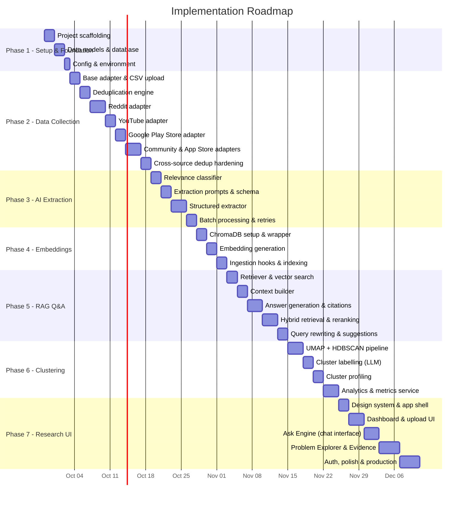
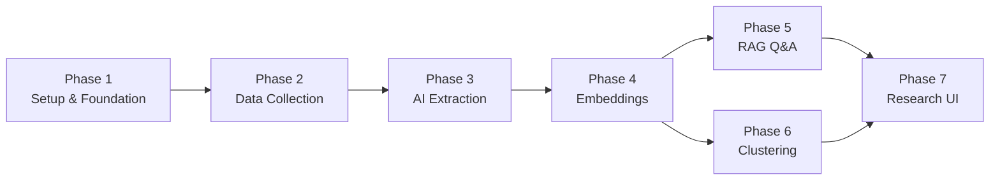

# Implementation Plan: AI-Powered Photo Retrieval Discovery Engine

> Phase-wise implementation plan derived from the [architecture document](file:///c:/Users/rparv/.antigravity-ide/Google%20Photos/docs/architecture.md). Organized into **7 domain-focused phases**, each building a self-contained functional layer.

---

## Phase Overview

| Phase | Domain | Goal |
|---|---|---|
| **1** | Project Setup & Foundation | Scaffolding, data models, database, dev environment |
| **2** | Data Collection & Ingestion | All source adapters, dedup, CSV upload, scraping |
| **3** | AI Extraction Pipeline | Relevance classification, structured extraction, prompts |
| **4** | Embeddings & Vector Store | Embedding generation, ChromaDB, vector search |
| **5** | RAG Q&A Engine | Retrieval, context assembly, grounded answers, citations |
| **6** | Problem Clustering & Analysis | UMAP + HDBSCAN, cluster labelling, analytics |
| **7** | Research UI & Dashboard | Full frontend — dashboard, chat, explorer, evidence cards |



---

## Phase 1: Project Setup & Foundation

> **Goal**: Set up the full project scaffolding — directory structure, data models, database, and dev environment — so all subsequent phases have a stable foundation to build on.

---

### Step 1.1 — Project Scaffolding

**Objective**: Create the project directory structure, install core dependencies, and configure dev tooling.

#### Backend Setup

| Task | Details |
|---|---|
| Initialize Python project | Create `backend/` directory with `requirements.txt` |
| Install core dependencies | `fastapi`, `uvicorn`, `sqlalchemy`, `chromadb`, `groq`, `sentence-transformers`, `pydantic`, `python-dotenv` |
| Create entry point | `backend/main.py` — FastAPI app with CORS, health check, router registration |
| Environment config | `backend/config.py` — load from `.env` (Groq API key, DB path, ChromaDB path) |
| Create `.env.example` | Template for required environment variables |

```python
# backend/requirements.txt (initial)
fastapi>=0.110.0
uvicorn[standard]>=0.29.0
sqlalchemy>=2.0.0
chromadb>=0.5.0
groq>=0.9.0
sentence-transformers>=3.0.0
torch>=2.0.0
pydantic>=2.0.0
python-dotenv>=1.0.0
python-multipart>=0.0.9
```

#### Frontend Setup

| Task | Details |
|---|---|
| Scaffold Vite + React | `npx -y create-vite@latest ./ --template react` in `frontend/` |
| Install dependencies | `react-router-dom`, `react-markdown` |
| Create API utility | `frontend/src/utils/api.js` — base URL config, fetch wrapper |
| Create app shell | `frontend/src/App.jsx` — router with navigation, layout skeleton |

#### Project Root

| Task | Details |
|---|---|
| `.gitignore` | Python, Node, `.env`, `data/raw/`, `__pycache__`, `node_modules`, `*.db` |
| `README.md` | Project title, description, setup instructions (to be expanded later) |
| `data/sample/` | Create directory with 1-2 sample CSV files for testing |

#### Deliverables
- [ ] `backend/main.py` — FastAPI app starts and serves `/api/health`
- [ ] `frontend/` — Vite dev server starts and renders app shell
- [ ] `.env.example` with documented variables
- [ ] `.gitignore` properly configured
- [ ] Both servers can start independently

---

### Step 1.2 — Data Models & Database

**Objective**: Define the relational schema for all core entities and set up SQLite via SQLAlchemy.

#### SQLAlchemy Models

**`backend/models/feedback.py`**:
```python
# FeedbackItem ORM model
# Fields: id (UUID PK), source (enum), source_url, author_id,
#         text, date, thread_id, parent_id, platform_metadata (JSON),
#         is_relevant (bool), relevance_score (float),
#         fingerprint (unique), ingested_at, extraction_status (enum)
```

**`backend/models/episode.py`**:
```python
# RetrievalEpisode ORM model
# Fields: id (UUID PK), feedback_item_id (FK), user_goal, memory_type (enum),
#         remembered_clues (JSON), forgotten_info (JSON),
#         retrieval_attempt (JSON), failure_reason (JSON),
#         desired_outcome, supporting_evidence,
#         source, source_url, problem_cluster, extracted_at
```

**`backend/models/cluster.py`**:
```python
# ProblemCluster ORM model
# Fields: id (UUID PK), label, summary, episode_count,
#         common_remembered_clues (JSON), common_forgotten_info (JSON),
#         common_retrieval_methods (JSON), common_failure_reasons (JSON),
#         representative_evidence (JSON), source_distribution (JSON),
#         created_at, updated_at
```

#### Database Setup

**`backend/db/database.py`**:
| Task | Details |
|---|---|
| Engine creation | SQLite for dev (`sqlite:///data/discovery.db`) |
| Session management | `SessionLocal` factory, `get_db` dependency |
| Table creation | Auto-create tables on startup via `Base.metadata.create_all()` |

#### Deliverables
- [ ] `backend/models/feedback.py` — `FeedbackItem` model with all fields from architecture §3.1
- [ ] `backend/models/episode.py` — `RetrievalEpisode` model with all fields from architecture §3.2
- [ ] `backend/models/cluster.py` — `ProblemCluster` model with all fields from architecture §3.4
- [ ] `backend/db/database.py` — engine, session, auto-create
- [ ] Database file creates successfully on first startup
- [ ] All models can be imported and used in tests

---

### Step 1.3 — Configuration & Environment

**Objective**: Centralize all configuration and ensure secure credential management.

| Task | Details |
|---|---|
| `backend/config.py` | Pydantic `Settings` class loading from `.env` |
| Required variables | `GROQ_API_KEY`, `DATABASE_URL`, `CHROMA_PERSIST_DIR` |
| Optional variables | `REDDIT_CLIENT_ID`, `REDDIT_CLIENT_SECRET`, `YOUTUBE_API_KEY`, `PLAYSTORE_LANG` |
| Validation | Fail fast on missing required variables at startup |
| Logging config | Structured JSON logging setup |

#### Deliverables
- [ ] `backend/config.py` — centralized config with validation
- [ ] `.env.example` — all variables documented with descriptions
- [ ] App fails gracefully with clear error if `.env` is missing required keys

---

## Phase 2: Data Collection & Ingestion

> **Goal**: Build the complete data ingestion layer — CSV/JSON upload, all 5 live source adapters, deduplication, and the scraping API — so the system can collect feedback from every target source.

---

### Step 2.1 — Base Adapter & CSV Upload

**Objective**: Build the adapter pattern and the first ingestion path (CSV/JSON upload).

#### Base Adapter

**`backend/services/ingestion/base_adapter.py`**:
```python
# Abstract base class defining the adapter interface:
# - parse(file_content) → List[FeedbackItem]
# - validate(item) → bool
# - compute_fingerprint(item) → str
```

#### CSV/JSON Adapter

**`backend/services/ingestion/csv_adapter.py`**:
| Task | Details |
|---|---|
| CSV parsing | Accept CSV with columns: `text`, `source`, `source_url`, `date`, `author_id` (optional) |
| JSON parsing | Accept JSON array of feedback objects |
| Normalization | Map input columns → `FeedbackItem` fields; handle missing/optional fields with defaults |
| Fingerprinting | SHA-256 of `(source + author_id + normalized_text)` |
| Validation | Require `text` field; validate URL format if present; normalize dates |

#### API Endpoint

**`backend/routers/ingest.py`**:
| Endpoint | Method | Description |
|---|---|---|
| `/api/ingest/upload` | `POST` | Accept multipart file upload (CSV/JSON), process through adapter, return ingestion stats |
| `/api/ingest/status` | `GET` | Return counts: total feedback, relevant, pending extraction |
| `/api/ingest/sources` | `GET` | List all configured sources and stats |

#### Sample Data

Create `data/sample/sample_feedback.csv` with **20-30 hand-curated sample rows** representing realistic photo-retrieval feedback from various hypothetical sources.

#### Deliverables
- [ ] `backend/services/ingestion/base_adapter.py` — abstract base
- [ ] `backend/services/ingestion/csv_adapter.py` — CSV/JSON parsing + normalization
- [ ] `backend/routers/ingest.py` — upload endpoint
- [ ] `data/sample/sample_feedback.csv` — test data
- [ ] Upload CSV via API → see items stored in SQLite

---

### Step 2.2 — Deduplication Engine

**Objective**: Build the deduplication service to prevent duplicate feedback across all sources.

**`backend/services/ingestion/dedup.py`**:
| Task | Details |
|---|---|
| Fingerprint check | Query existing fingerprints before insert |
| Bulk dedup | Batch fingerprint lookups for performance |
| Return stats | Report: total rows, new items, duplicates skipped |
| Upsert support | Skip or update existing items based on config |

#### Deliverables
- [ ] `backend/services/ingestion/dedup.py` — fingerprint-based dedup
- [ ] Upload same CSV twice → second upload shows "X duplicates skipped"
- [ ] Dedup stats returned in API response

---

### Step 2.3 — Reddit Adapter

**Objective**: Ingest photo-retrieval discussions from Reddit via API.

**`backend/services/ingestion/reddit_adapter.py`**:

| Task | Details |
|---|---|
| Authentication | Reddit API via PRAW; credentials in `.env` |
| Target subreddits | `r/googlephotos`, `r/GooglePixel`, `r/Android`, `r/iphone`, `r/photography` (configurable) |
| Search queries | "find old photos", "search photos", "can't find photo", "photo search", etc. |
| Data extraction | Post title + body + top-level comments → separate `FeedbackItem` per post/comment |
| Thread linking | Set `thread_id` for posts; `parent_id` for comments |
| Platform metadata | `subreddit`, `score`, `num_comments`, `created_utc` |
| Rate limiting | Respect Reddit API rate limits (60 req/min) |
| Pagination | Fetch up to N posts per query (configurable, default: 100) |

#### API Endpoint

| Endpoint | Method | Description |
|---|---|---|
| `/api/ingest/scrape` | `POST` | Accept `{ source: "reddit", query, subreddits?, limit? }` → trigger scrape → return job ID |

#### Dependencies
```
# Add to requirements.txt
praw>=7.7.0
```

#### Deliverables
- [ ] `reddit_adapter.py` — PRAW-based Reddit scraper
- [ ] Scrape endpoint for Reddit
- [ ] Successfully ingest 100+ posts from `r/googlephotos`
- [ ] Dedup works across multiple scrape runs

---

### Step 2.4 — YouTube Adapter

**Objective**: Ingest comments from YouTube videos about Google Photos and photo retrieval.

**`backend/services/ingestion/youtube_adapter.py`**:

| Task | Details |
|---|---|
| Authentication | YouTube Data API v3; API key in `.env` |
| Video discovery | Search for videos about "Google Photos tips", "photo search", "find old photos" |
| Comment extraction | Fetch top-level comments + replies for each video |
| Normalization | Comment text → `FeedbackItem`; video ID as `thread_id` |
| Platform metadata | `video_id`, `video_title`, `like_count`, `published_at` |
| Quota management | YouTube API has daily quota limits; implement tracking |

#### Dependencies
```
# Add to requirements.txt
google-api-python-client>=2.100.0
```

#### Deliverables
- [ ] `youtube_adapter.py` — YouTube Data API comment scraper
- [ ] Scrape endpoint supports `source: "youtube"`
- [ ] Successfully ingest comments from 10+ relevant videos
- [ ] Quota usage tracked and logged

---

### Step 2.5 — Google Play Store Adapter

**Objective**: Ingest Google Photos app reviews from the Google Play Store.

**`backend/services/ingestion/playstore_adapter.py`**:

| Task | Details |
|---|---|
| Library | `google-play-scraper` Python package |
| Target app | Google Photos (`com.google.android.apps.photos`) |
| Review fetching | Fetch reviews sorted by relevance and recency |
| Filtering | Filter for reviews mentioning search, find, retrieve, organize, etc. |
| Normalization | Review text + rating → `FeedbackItem`; set `source: "playstore"` |
| Platform metadata | `rating`, `thumbs_up_count`, `review_created_version`, `reply_content` |
| Pagination | Fetch in batches (default: 200 reviews per run) |

#### Dependencies
```
# Add to requirements.txt
google-play-scraper>=1.2.0
```

#### Deliverables
- [ ] `playstore_adapter.py` — Google Play Store review scraper
- [ ] Scrape endpoint supports `source: "playstore"`
- [ ] Successfully ingest 200+ relevant Google Photos reviews
- [ ] Reviews include ratings and metadata

---

### Step 2.6 — Community & App Store Adapters

**Objective**: Add the remaining source adapters for Google Photos Community forums and Apple App Store.

#### Community Adapter

**`backend/services/ingestion/community_adapter.py`**:

| Task | Details |
|---|---|
| Target | Google Photos Community (support.google.com/photos/community) |
| Method | HTML scraping or structured export |
| Normalization | Thread + replies → `FeedbackItem`s |
| Thread linking | Preserve thread structure with `thread_id` and `parent_id` |

#### App Store Adapter

**`backend/services/ingestion/appstore_adapter.py`**:

| Task | Details |
|---|---|
| Target | Apple App Store reviews for Google Photos |
| Library | `app-store-scraper` or equivalent |
| Normalization | Reviews → `FeedbackItem`s with `source: "appstore"` |
| Platform metadata | `rating`, `version`, `country` |

#### Deliverables
- [ ] `community_adapter.py` — Google Photos Community scraper
- [ ] `appstore_adapter.py` — Apple App Store review scraper
- [ ] Scrape endpoint supports all 6 sources (CSV, Reddit, YouTube, Play Store, Community, App Store)
- [ ] All adapters produce consistent `FeedbackItem` format

---

### Step 2.7 — Cross-Source Deduplication Hardening

**Objective**: Harden dedup for multi-source ingestion where the same user may post similar feedback across platforms.

| Task | Details |
|---|---|
| Cross-source dedup | Detect near-duplicate feedback across different sources (same user posting on Reddit and YouTube) |
| Semantic dedup | Optional: use embedding similarity to detect paraphrased duplicates (threshold: 0.95) |
| Source-specific noise filtering | Handle platform-specific noise patterns (e.g., "great app 5 stars" Play Store reviews) |
| Ingestion stats | Show per-source breakdown: total, new, duplicates, noise-filtered |

#### Deliverables
- [ ] Cross-source fingerprint dedup
- [ ] Optional semantic dedup for paraphrased content
- [ ] Ingestion stats show detailed per-source breakdown

---

## Phase 3: AI Extraction Pipeline

> **Goal**: Build the complete AI-powered extraction layer — classify relevant feedback, extract structured retrieval episodes using Groq (Llama 3 / Mixtral), and handle batch processing with error recovery.

---

### Step 3.1 — Relevance Classifier

**Objective**: Build an LLM-based classifier that determines whether a piece of feedback relates to photo retrieval.

**`backend/services/extraction/relevance.py`**:

| Task | Details |
|---|---|
| LLM-based classification | Prompt Groq (Llama 3): "Is this feedback about retrieving/finding old photos, videos, or screenshots?" |
| Output | `is_relevant: bool`, `relevance_score: float` |
| Update | Set `FeedbackItem.is_relevant` and `FeedbackItem.relevance_score` |
| Batch support | Process items in batches of 10 |
| Source-specific tuning | Include source-specific examples to handle noise patterns per platform |

#### Deliverables
- [ ] `backend/services/extraction/relevance.py` — relevance classifier
- [ ] Correctly identifies relevant photo-retrieval feedback from noisy app reviews
- [ ] Batch processing with configurable batch size
- [ ] Relevance scores stored on `FeedbackItem` records

---

### Step 3.2 — Extraction Prompts & Schema

**Objective**: Design and implement the structured extraction prompt that converts feedback into retrieval episodes.

**`backend/services/extraction/prompts.py`**:

| Task | Details |
|---|---|
| System prompt | Role definition: "You are a research analyst extracting structured retrieval episodes..." |
| Extraction schema | JSON schema matching `RetrievalEpisode` model |
| Controlled vocabularies | All enums from architecture §3.3 embedded in prompt |
| Few-shot examples | 2-3 examples of input → expected output |
| Grounding rules | "Extract ONLY from the text. Use null for missing fields. Quote evidence verbatim." |

#### Controlled Vocabularies (embedded in prompt)

| Vocabulary | Values |
|---|---|
| Memory Type | `photo`, `screenshot`, `document`, `video`, `person_image`, `object_image`, `other` |
| Remembered Clue Type | `person`, `location`, `event_trip`, `object`, `approximate_time`, `activity`, `visual_appearance`, `text_content`, `context`, `other` |
| Forgotten Info Type | `exact_date`, `exact_location`, `album`, `filename`, `person_name`, `object_name`, `search_terms`, `other` |
| Retrieval Method | `keyword_search`, `timeline_browsing`, `album_browsing`, `scrolling`, `face_person_search`, `visual_scanning`, `workaround`, `other` |
| Failure Reason | `cannot_formulate_query`, `too_many_results`, `forgotten_date_location`, `context_not_translatable_to_keywords`, `difficulty_describing_visual`, `uncertainty_between_similar`, `feature_missing`, `other` |

#### Deliverables
- [ ] `backend/services/extraction/prompts.py` — system prompt, schema, few-shot examples
- [ ] Prompt tested manually against 10+ sample inputs
- [ ] Output reliably conforms to the `RetrievalEpisode` JSON schema

---

### Step 3.3 — Structured Extractor

**Objective**: Build the extraction service that processes feedback items through Groq and creates structured episodes.

**`backend/services/extraction/extractor.py`**:

| Task | Details |
|---|---|
| Process single item | Send `FeedbackItem.text` to Groq with extraction prompt → parse JSON response → create `RetrievalEpisode` |
| JSON validation | Validate LLM output against expected schema; reject malformed extractions |
| Status tracking | Update `FeedbackItem.extraction_status` (`pending` → `processing` → `completed` / `failed`) |
| Store episode | Create `RetrievalEpisode` record linked to source `FeedbackItem` |

#### API Endpoint

| Endpoint | Method | Description |
|---|---|---|
| `/api/ingest/extract` | `POST` | Trigger extraction for all `pending` feedback items |

#### Deliverables
- [ ] `backend/services/extraction/extractor.py` — Gemini-based structured extraction
- [ ] Extraction endpoint triggers and processes pending items
- [ ] Sample CSV → upload → extract → `RetrievalEpisode` records in SQLite
- [ ] Extraction output matches the expected schema

---

### Step 3.4 — Batch Processing & Error Recovery

**Objective**: Harden extraction for production-scale processing with batch support, retries, and status tracking.

| Task | Details |
|---|---|
| Batch processing | Configurable batch size (default: 10) |
| Error handling | Retry with exponential backoff (max 3 retries per item) |
| Failure marking | Items that fail all retries → `extraction_status = "failed"` |
| Resumability | Re-running extraction only processes `pending` and `failed` items |
| Progress reporting | API returns: total pending, processing, completed, failed counts |
| Re-extraction support | Flag to re-extract all items (e.g., after prompt update) |

#### Deliverables
- [ ] Batch extraction with configurable batch size
- [ ] Exponential backoff retry logic
- [ ] Failed items logged and retryable
- [ ] Extraction status endpoint shows progress
- [ ] Re-extraction works when prompt/schema is updated

---

## Phase 4: Embeddings & Vector Store

> **Goal**: Set up ChromaDB, generate embeddings for both raw feedback and structured episodes, and wire embedding generation into the ingestion/extraction pipeline.

---

### Step 4.1 — ChromaDB Setup & Wrapper

**Objective**: Initialize ChromaDB with persistent storage and build a clean wrapper interface.

**`backend/db/vector_store.py`**:

| Task | Details |
|---|---|
| Initialize ChromaDB | Persistent local storage at `data/chroma/` |
| Create collections | `feedback_embeddings` and `episode_embeddings` with metadata schemas |
| Add documents | Batch upsert with embeddings + metadata |
| Search | Similarity search with metadata filters, configurable `top_k` |
| Delete | Remove by ID (for re-ingestion/cleanup) |
| Health check | Verify ChromaDB connectivity for `/api/health` |

#### Vector DB Collections

```
Collection: feedback_embeddings
  - id: string (feedback_item_id)
  - embedding: float[1024]
  - metadata:
      - source: string
      - date: ISO-8601
      - is_relevant: bool
      - episode_id: string | null

Collection: episode_embeddings
  - id: string (episode_id)
  - embedding: float[1024]
  - metadata:
      - memory_type: string
      - failure_reason: string[]
      - retrieval_method: string[]
      - problem_cluster: string | null
      - source: string
```

#### Deliverables
- [ ] `backend/db/vector_store.py` — ChromaDB wrapper with add/search/delete
- [ ] Both collections created on startup
- [ ] Health check reports ChromaDB status
- [ ] Wrapper supports batch operations

---

### Step 4.2 — Embedding Generation

**Objective**: Generate embeddings for raw feedback and structured episodes using BGE (`bge-large-en-v1.5`).

| Task | Details |
|---|---|
| Model | BGE `bge-large-en-v1.5` via `sentence-transformers` (local inference, 1024-dim) |
| Raw feedback | Embed `FeedbackItem.text` as-is |
| Episodes | Embed concatenation: `user_goal + " | " + remembered_clues_text + " | " + forgotten_info_text + " | " + failure_reasons_text` |
| Batch embed | Process in batches of 64 texts (local GPU/CPU) |
| Store metadata | Source, date, is_relevant, memory_type, failure_reason, etc. |
| Error handling | Retry failed embedding requests; log and skip items that cannot be embedded |

#### Deliverables
- [ ] Embedding generation for raw feedback texts
- [ ] Embedding generation for structured episode text
- [ ] Batch embedding with local inference
- [ ] Embeddings stored in ChromaDB with correct metadata

---

### Step 4.3 — Ingestion Hooks & Auto-Indexing

**Objective**: Wire embedding generation into the ingestion and extraction pipelines so new data is automatically indexed.

| Task | Details |
|---|---|
| Post-ingestion hook | After CSV upload or scrape, automatically generate embeddings for new `FeedbackItem`s |
| Post-extraction hook | After extraction, generate embeddings for new `RetrievalEpisode`s |
| Re-indexing endpoint | API endpoint to re-generate all embeddings (e.g., after model change) |
| Index status tracking | Track which items have been embedded; skip already-indexed items |

#### Deliverables
- [ ] Embeddings auto-generated after ingestion
- [ ] Embeddings auto-generated after extraction
- [ ] Re-indexing endpoint for bulk re-embedding
- [ ] Vector search returns relevant results for test queries

---

## Phase 5: RAG Q&A Engine

> **Goal**: Build the complete Retrieval-Augmented Generation engine — from query processing through evidence retrieval to grounded answer generation with citations.

---

### Step 5.1 — Retriever & Vector Search

**Objective**: Build the retrieval layer that searches across both collections and merges results.

**`backend/services/rag/retriever.py`**:

| Task | Details |
|---|---|
| Vector search | ChromaDB similarity search with `top_k` and `similarity_threshold` |
| Metadata filters | Optional filters by source, date range |
| Dual-collection search | Search both `feedback_embeddings` and `episode_embeddings` |
| Result merging | Combine results from both collections, deduplicate by feedback_id |
| Score normalization | Normalize similarity scores across collections for fair ranking |

#### Retrieval Parameters

| Parameter | Default | Description |
|---|---|---|
| `top_k` | 20 | Number of candidate documents retrieved from vector search |
| `similarity_threshold` | 0.65 | Minimum cosine similarity to include a result |

#### Deliverables
- [ ] `backend/services/rag/retriever.py` — vector search + filtering
- [ ] Search across both collections with result merging
- [ ] Metadata filtering works (source, date range)
- [ ] Returns ranked, deduplicated results

---

### Step 5.2 — Context Builder

**Objective**: Assemble retrieved documents into a context window suitable for LLM answer generation.

**`backend/services/rag/context_builder.py`**:

| Task | Details |
|---|---|
| Ranking | Sort retrieved documents by relevance score |
| Token counting | Estimate token count per document; stop adding when limit reached |
| Context formatting | Format each document as: `[Source: reddit] [Date: 2026-01-15] "excerpt..."` |
| Low-evidence warning | If < 3 documents found, prepend warning message |
| Deduplication | Remove near-duplicate evidence before assembly |

| Parameter | Default | Description |
|---|---|---|
| `rerank_top_n` | 8 | Number of documents after reranking to include in context |
| `max_context_tokens` | 6000 | Maximum tokens in the assembled context window |

#### Deliverables
- [ ] `backend/services/rag/context_builder.py` — context window assembly
- [ ] Token-aware context window respects limits
- [ ] Low-evidence scenarios handled with warning prefix
- [ ] Context formatting includes source attribution

---

### Step 5.3 — Answer Generation & Citations

**Objective**: Generate grounded answers using the assembled context and attach source citations.

**`backend/services/rag/query_engine.py`**:

| Task | Details |
|---|---|
| Query embedding | Embed the user's question using BGE (local) |
| Full pipeline | Retrieve → build context → generate answer → attach citations |
| Citation formatting | Map each claim back to source `FeedbackItem` IDs and URLs |
| Confidence scoring | Rate answer confidence based on evidence count and relevance scores |

#### Answer Generation Prompt

```
System: You are a research analyst. Answer the question using ONLY the evidence
provided below. Cite specific sources using [Source N] notation. If evidence is
insufficient, explicitly say so. Never fabricate quotes or statistics.

Evidence:
{assembled_context}

Question: {user_question}
```

#### Grounding Rules

- Every claim must cite at least one source document.
- If fewer than 3 relevant documents are found, prefix: *"Limited evidence available — the following is based on [N] source(s)."*
- The system **never** fabricates quotes or statistics.

#### API Endpoint

**`backend/routers/ask.py`**:
| Endpoint | Method | Description |
|---|---|---|
| `/api/ask` | `POST` | Accept `{ question, filters? }` → return `{ answer, citations[], evidence_count, confidence }` |

#### Deliverables
- [ ] `backend/services/rag/query_engine.py` — full RAG pipeline
- [ ] `backend/routers/ask.py` — Q&A endpoint
- [ ] Ask a question → get grounded answer with citations referencing real feedback
- [ ] Low-evidence scenarios handled gracefully
- [ ] Confidence scoring reflects evidence quality

---

### Step 5.4 — Hybrid Retrieval & Reranking

**Objective**: Improve answer quality by combining vector search with keyword/metadata filtering and adding a reranking step.

| Task | Details |
|---|---|
| Keyword search | SQLAlchemy full-text search on `FeedbackItem.text` and `RetrievalEpisode.user_goal` |
| Metadata filters | Filter by: source, date range, memory type, failure reason, cluster |
| Hybrid merge | Combine vector similarity results with keyword matches; reciprocal rank fusion |
| Reranking | Score merged results using a cross-encoder or LLM-based relevance scoring |
| Configurable weights | `vector_weight` vs `keyword_weight` (default: 0.7 / 0.3) |

#### Updated Retrieval Parameters

| Parameter | Default | Description |
|---|---|---|
| `top_k` | 30 | Increased candidate pool for hybrid retrieval |
| `rerank_top_n` | 8 | Documents after reranking |
| `vector_weight` | 0.7 | Weight for vector similarity in fusion |
| `keyword_weight` | 0.3 | Weight for keyword match in fusion |

#### Deliverables
- [ ] Hybrid retriever combining vector + keyword search
- [ ] Reranking step produces better-ordered results
- [ ] Measurably improved answer quality on test questions
- [ ] Filter support in API (source, date range, memory type)

---

### Step 5.5 — Query Rewriting & Follow-up Suggestions

**Objective**: Improve the conversational experience with query optimization and suggested follow-ups.

| Task | Details |
|---|---|
| Query rewriting | LLM rewrites user question → optimized search query (handles ambiguous, overly broad, or colloquial questions) |
| Multi-query decomposition | Complex questions → multiple sub-queries → merged results |
| Follow-up suggestions | After each answer, LLM generates 2-3 follow-up questions based on the evidence |
| Conversation history | `/api/ask/history` — store and retrieve past Q&A sessions |

#### API Endpoints

| Endpoint | Method | Description |
|---|---|---|
| `/api/ask` | `POST` | Updated with query rewriting + follow-up suggestions in response |
| `/api/ask/history` | `GET` | Get previous questions and answers |

#### Deliverables
- [ ] Query rewriting in RAG pipeline
- [ ] Multi-query decomposition for complex questions
- [ ] Follow-up suggestion generation
- [ ] Q&A history endpoint

---

## Phase 6: Problem Clustering & Analysis

> **Goal**: Build the unsupervised clustering pipeline that groups retrieval episodes into thematic problem areas, generates human-readable labels, computes cluster profiles, and provides aggregate analytics.

---

### Step 6.1 — UMAP + HDBSCAN Clustering Pipeline

**Objective**: Implement the core clustering algorithm that groups episode embeddings into problem areas.

**`backend/services/clustering/clusterer.py`**:

| Task | Details |
|---|---|
| Load embeddings | Fetch all episode embeddings from ChromaDB |
| Dimensionality reduction | UMAP: `n_components=5`, `n_neighbors=15`, `min_dist=0.1` |
| Clustering | HDBSCAN: `min_cluster_size=5`, `min_samples=3` |
| Noise handling | Episodes not assigned to any cluster → label as "uncategorized" |
| Seeded initialization | Use architecture §2.5 seeded categories for initial guidance |
| Persist results | Update `RetrievalEpisode.problem_cluster` for each episode |
| Re-clustering | Support re-running when new data is ingested |

#### Seeded Categories

- Event/trip-based retrieval
- People/context retrieval
- Visual-object retrieval
- Screenshot/document retrieval
- Location-based retrieval
- Approximate-time retrieval
- Text-inside-image retrieval

#### Dependencies

```
# Add to requirements.txt
umap-learn>=0.5.0
hdbscan>=0.8.0
scikit-learn>=1.4.0
```

#### Deliverables
- [ ] `clusterer.py` — UMAP + HDBSCAN pipeline
- [ ] Clustering produces stable, meaningful groupings
- [ ] At least 3-5 distinct clusters from sample data
- [ ] Noise points handled as "uncategorized"
- [ ] Re-clustering produces updated assignments

---

### Step 6.2 — Cluster Labelling (LLM)

**Objective**: Use Groq (Llama 3) to generate human-readable labels and summaries for each cluster.

**`backend/services/clustering/labeller.py`**:

| Task | Details |
|---|---|
| Sample episodes | For each cluster, sample 5-8 representative episodes |
| LLM labelling | Prompt Groq (Llama 3): "Read these retrieval episodes and generate a concise label and summary for this problem area" |
| Label quality | Labels should be specific (e.g., "Event/Trip-Based Retrieval") not generic ("Cluster 1") |
| Persistence | Store labels in `ProblemCluster` records |

#### Deliverables
- [ ] `labeller.py` — LLM-based cluster labelling
- [ ] Each cluster has a human-readable label + summary
- [ ] Labels are descriptive and specific to the retrieval problem

---

### Step 6.3 — Cluster Profiling

**Objective**: Compute detailed profiles for each cluster showing common patterns, failure reasons, and source distribution.

| Task | Details |
|---|---|
| Episode count | Count episodes per cluster |
| Common remembered clues | Frequency analysis of `remembered_clues` types |
| Common forgotten info | Frequency analysis of `forgotten_info` types |
| Dominant retrieval methods | Frequency analysis of `retrieval_attempt` methods |
| Dominant failure reasons | Frequency analysis of `failure_reason` values |
| Representative evidence | Select 3-5 most representative episode excerpts per cluster |
| Source distribution | Count episodes by source per cluster |
| Store profiles | Create/update `ProblemCluster` records in SQLite |

#### API Endpoints

| Endpoint | Method | Description |
|---|---|---|
| `/api/clusters` | `GET` | List all clusters with summaries and episode counts |
| `/api/clusters/:id` | `GET` | Detailed cluster profile |
| `/api/clusters/:id/episodes` | `GET` | Episodes in this cluster (paginated) |
| `/api/clusters/recompute` | `POST` | Trigger re-clustering |

#### Deliverables
- [ ] `backend/routers/clusters.py` — cluster API endpoints
- [ ] Cluster profiles show meaningful pattern breakdowns
- [ ] Representative evidence is genuinely representative
- [ ] Re-compute endpoint triggers full re-clustering + re-profiling

---

### Step 6.4 — Analytics & Metrics Service

**Objective**: Build the aggregate analytics service that powers dashboard metrics and trend analysis.

**`backend/services/analytics/metrics.py`**:

| Metric | Endpoint | Computation |
|---|---|---|
| Overview stats | `/api/analytics/overview` | Total feedback, relevant count, episode count, cluster count |
| Source breakdown | `/api/analytics/sources` | Per-source counts + relevance rates |
| Distributions | `/api/analytics/distributions` | Memory type distribution, failure reason distribution, retrieval method distribution |
| Top patterns | `/api/analytics/trends` | Most common remembered clues, most common forgotten info |
| Top failure reasons | — | Frequency analysis across episodes |
| Retrieval method distribution | — | Frequency analysis across episodes |

#### Caching

| Task | Details |
|---|---|
| In-memory cache | Cache computed metrics; invalidate on ingestion events |
| Cache TTL | Default: 5 minutes; manual invalidation on data changes |
| Response time target | < 200ms for cached analytics |

**`backend/routers/analytics.py`**:

| Endpoint | Method | Description |
|---|---|---|
| `/api/analytics/overview` | `GET` | Dashboard summary metrics |
| `/api/analytics/sources` | `GET` | Source breakdown stats |
| `/api/analytics/trends` | `GET` | Trend data over time |
| `/api/analytics/distributions` | `GET` | Distribution of memory types, failure reasons, etc. |

#### Deliverables
- [ ] `backend/services/analytics/metrics.py` — all analytics computations
- [ ] `backend/routers/analytics.py` — analytics API endpoints
- [ ] Analytics cached with < 200ms response time
- [ ] Metrics refresh on new data ingestion

---

## Phase 7: Research UI & Dashboard

> **Goal**: Build the complete frontend — design system, dashboard with rich metrics, conversational Q&A interface, Problem Explorer with drill-down, evidence cards, and production polish (auth, performance, responsive design).

---

### Step 7.1 — Design System & App Shell

**Objective**: Create the CSS design system and app shell that all components will use.

#### Design System (`frontend/src/index.css`)

| Token | Details |
|---|---|
| Color palette | Dark theme with accent gradients; semantic colors for sources (Reddit = orange, YouTube = red, Play Store = green, Community = blue, App Store = purple) |
| Typography | Google Fonts — Inter for body, JetBrains Mono for code/data |
| Spacing | 4px base unit scale |
| Border radius | Consistent rounded corners (8px cards, 12px panels) |
| Shadows | Layered elevation system |
| Animations | Fade-in, slide-up for cards; smooth transitions |
| Glassmorphism | Frosted glass effect for key panels |

#### App Shell (`frontend/src/App.jsx`)

| Element | Details |
|---|---|
| Navigation sidebar | Icon + label nav: Dashboard, Ask, Explore |
| Header | App title + status indicator |
| Layout | Responsive sidebar + main content area |
| Router | React Router with route-based code splitting |

#### Routing

| Route | Component |
|---|---|
| `/` | Dashboard |
| `/ask` | AskEngine |
| `/explore` | ProblemExplorer |
| `/explore/:clusterId` | ClusterDetail |

#### Deliverables
- [ ] `index.css` — complete design system with dark theme, micro-animations
- [ ] `App.jsx` — app shell with navigation and routing
- [ ] Design feels premium, modern, and polished
- [ ] Responsive layout works on desktop and tablet

---

### Step 7.2 — Dashboard & Upload UI

**Objective**: Build the discovery dashboard with metrics, charts, and the data upload interface.

**`Dashboard.jsx`**:

| Element | Details |
|---|---|
| Stat cards | Total feedback, relevant feedback, retrieval episodes, cluster count — animated counters |
| Source breakdown | Horizontal bar chart or donut chart (color-coded by source) |
| Memory type distribution | Bar chart of photo vs. screenshot vs. video vs. document |
| Failure reasons chart | Ranked bar chart of why retrieval fails |
| Retrieval methods chart | How users try to find their photos |
| Recent activity | Last 5 ingested items with status badges |
| Upload trigger | Button to open upload modal |

**Upload interface** (modal or embedded):

| Element | Details |
|---|---|
| File dropzone | Drag-and-drop CSV/JSON upload with file type validation |
| Upload progress | Progress bar + result stats (items ingested, duplicates skipped) |
| Trigger extraction | Button to run extraction on uploaded data |
| Scrape trigger | Source selector + query input → trigger live scraping |

**`SourceBreakdown.jsx`**:
- Reusable chart component for source distribution visualizations

#### API Client (`frontend/src/utils/api.js`)

- `uploadFeedback(file)` → `POST /api/ingest/upload`
- `triggerScrape(source, query)` → `POST /api/ingest/scrape`
- `triggerExtraction()` → `POST /api/ingest/extract`
- `getAnalytics()` → `GET /api/analytics/overview`
- `getSourceBreakdown()` → `GET /api/analytics/sources`
- `getDistributions()` → `GET /api/analytics/distributions`

#### Deliverables
- [ ] `Dashboard.jsx` — stat cards with animated counters, charts
- [ ] Upload modal with drag-and-drop + progress
- [ ] Scrape trigger for live data sources
- [ ] `SourceBreakdown.jsx` — chart component
- [ ] Dashboard auto-refreshes on new data ingestion

---

### Step 7.3 — Ask Engine (Chat Interface)

**Objective**: Build the conversational Q&A interface powered by the RAG engine.

**`AskEngine.jsx`**:

| Element | Details |
|---|---|
| Chat input | Text input with send button; supports Enter to submit |
| Response display | Rendered markdown answer with smooth reveal animation |
| Citation cards | Expandable cards showing source, excerpt, date, URL |
| Loading state | Typing indicator while waiting for RAG response |
| Suggested questions | Pre-filled example questions (clickable chips) |
| Follow-up chips | Clickable follow-up suggestions after each answer |
| Filter controls | Source multi-select, date range picker |
| History sidebar | Previous questions accessible from panel |
| Confidence badge | Visual indicator of answer confidence level |

#### Example Suggested Questions

- "What kinds of old photos do users struggle to retrieve?"
- "What information do users remember most often?"
- "What retrieval workarounds do users use?"
- "Show examples of users remembering an event but not the date."
- "Which retrieval problems appear across multiple sources?"

#### API Client

- `askQuestion(question, filters)` → `POST /api/ask`
- `getAskHistory()` → `GET /api/ask/history`

#### Deliverables
- [ ] `AskEngine.jsx` — full chat interface with citations
- [ ] Follow-up suggestion chips work
- [ ] Filter controls (source, date range) work
- [ ] History sidebar shows past Q&A sessions
- [ ] Smooth animations for response reveal
- [ ] End-to-end flow: ask question → loading → answer with expandable citations

---

### Step 7.4 — Problem Explorer & Evidence Cards

**Objective**: Build the problem area explorer with drill-down into individual clusters and evidence.

**`ProblemExplorer.jsx`**:

| Element | Details |
|---|---|
| Cluster cards grid | Card per problem area: label, summary, episode count, top failure reasons |
| Sort/filter | Sort by episode count; filter by source |
| Click-through | Click card → navigate to cluster detail view |
| Visual indicators | Color gradient based on episode count (heat scale) |

**`ClusterDetail.jsx`**:

| Element | Details |
|---|---|
| Header | Cluster label + summary + episode count |
| Pattern breakdown | Visual bars for: remembered clues, forgotten info, retrieval methods, failure reasons |
| Evidence list | Scrollable list of `EvidenceCard`s for episodes in this cluster |
| Source distribution | Mini donut chart showing which sources contribute to this cluster |
| Back navigation | Breadcrumb: Dashboard → Problem Explorer → [Cluster Name] |

**`EvidenceCard.jsx`**:

| Element | Details |
|---|---|
| Source badge | Color-coded badge (Reddit = orange, YouTube = red, Play Store = green, etc.) |
| Excerpt | Supporting evidence quote with keyword highlighting |
| Memory type | Tag showing what the user was trying to find |
| Failure reason | Tag showing why retrieval failed |
| Remembered / forgotten | Compact tags showing what was remembered vs. forgotten |
| Date | When the feedback was posted |
| Source link | External link to original source URL |
| Expand/collapse | Click to see full retrieval episode details |
| Micro-animations | Smooth expand/collapse transition |

#### API Client

- `getClusters()` → `GET /api/clusters`
- `getClusterDetail(id)` → `GET /api/clusters/:id`
- `getClusterEpisodes(id, page)` → `GET /api/clusters/:id/episodes`

#### Deliverables
- [ ] `ProblemExplorer.jsx` — cluster card grid with sort/filter
- [ ] `ClusterDetail.jsx` — detailed cluster view with pattern breakdowns
- [ ] `EvidenceCard.jsx` — individual evidence display with source badges
- [ ] Navigation: Dashboard → Problem Explorer → Cluster Detail → Evidence
- [ ] Responsive layout works on desktop and tablet
- [ ] Animations and transitions feel smooth and polished

---

### Step 7.5 — Authentication, Polish & Production Readiness

**Objective**: Add access control, optimize performance, and prepare for production deployment.

#### Authentication

| Task | Details |
|---|---|
| API key auth | Simple API key in `Authorization` header for all `/api/*` endpoints |
| Login page | Frontend login form → store API key in session storage |
| Protected routes | Frontend route guards; redirect to login if unauthenticated |
| Rate limiting | Basic rate limiting on `/api/ask` (prevent LLM cost abuse) |
| CORS hardening | Restrict allowed origins to frontend domain |

#### Performance Optimization

| Task | Details |
|---|---|
| Lazy loading | Lazy-load evidence cards, paginate cluster episodes |
| Code splitting | Route-based code splitting in Vite |
| Frontend build | Production build with tree shaking |
| Backend async | Celery + Redis for async extraction jobs (or in-process queue) |

#### Observability

| Task | Details |
|---|---|
| Structured logging | JSON logs with request IDs across all services |
| Health endpoint | `/api/health` — DB, vector store, LLM connectivity status |
| Metrics tracking | Log: ingestion throughput, extraction success rate, RAG latency |

#### Production Infrastructure

| Task | Details |
|---|---|
| PostgreSQL migration | Swap SQLAlchemy connection string; Alembic migrations |
| Qdrant migration | Replace ChromaDB wrapper with Qdrant client |
| Docker Compose | PostgreSQL + Qdrant + Redis services |
| Data migration script | SQLite → PostgreSQL; ChromaDB → Qdrant |

#### Deliverables
- [ ] API key middleware in FastAPI
- [ ] Login page in frontend
- [ ] Rate limiting on expensive endpoints
- [ ] Analytics response time < 200ms (cached)
- [ ] RAG Q&A response time < 5s (including LLM)
- [ ] `/api/health` endpoint
- [ ] Structured logging throughout
- [ ] `docker-compose.yml` for production infrastructure
- [ ] Production build works end-to-end

---

## Validation Checkpoints

After each phase, validate against the success criteria from the [problem statement](file:///c:/Users/rparv/.antigravity-ide/Google%20Photos/docs/problemstatement.txt):

| Criterion | P1 | P2 | P3 | P4 | P5 | P6 | P7 |
|---|---|---|---|---|---|---|---|
| Identify relevant feedback | — | ✅ CSV | ✅ Classified | — | — | — | ✅ All sources |
| Distinguish remembered vs. forgotten | — | — | ✅ | — | — | — | ✅ |
| Identify recurring failure patterns | — | — | ✅ Extracted | — | — | ✅ Clustered | ✅ |
| Compare problem areas with evidence | — | — | — | — | — | ✅ | ✅ |
| Source-backed research Q&A | — | — | — | — | ✅ Basic | — | ✅ Hybrid |
| Traceable findings | — | — | ✅ Episodes | ✅ Indexed | ✅ Citations | ✅ Evidence | ✅ Full UI |
| Meaningful opportunity areas | — | — | — | — | — | ✅ Clusters | ✅ Profiled |

---

## Phase Dependencies



> **Note**: Phases 5 (RAG) and 6 (Clustering) can be developed **in parallel** after Phase 4 is complete. Phase 7 depends on both.

---

*This plan is derived from [architecture.md](file:///c:/Users/rparv/.antigravity-ide/Google%20Photos/docs/architecture.md). Update step completion status as implementation progresses.*
